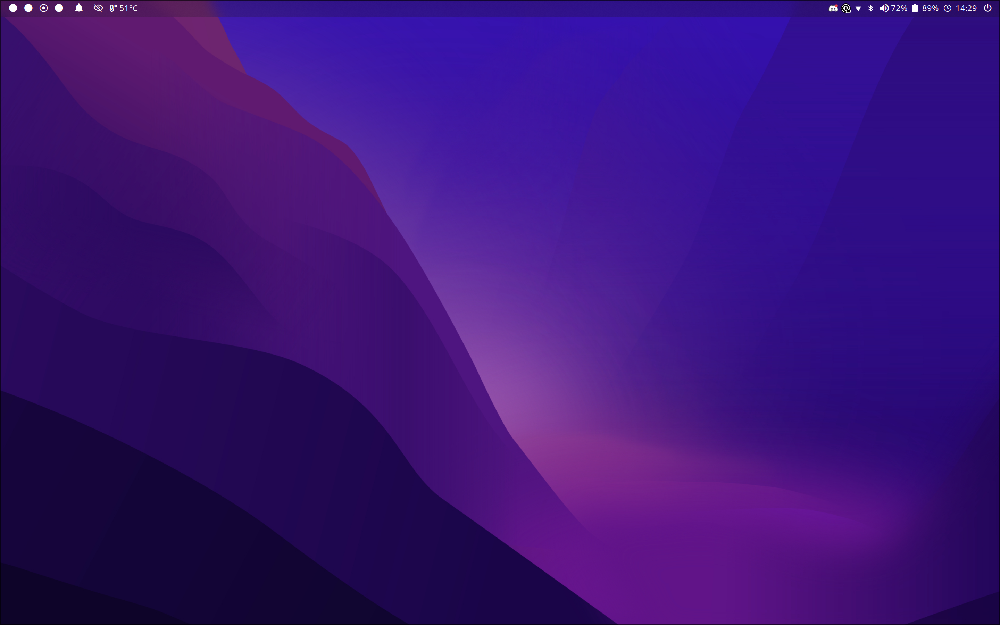

# dotfiles

This is the backup of my dotfiles

## Screenshots



## Packages
```sh
alacritty
bat
blueman
bluez
brightnessctl
cliphist
clipnotify
eza
hypridle
hyprland
hyprlock
hyprpaper
hyprshot
inotify-tools
mako
nautilus
nerd-fonts
networkmanager
network-manager-applet
nwg-look
pipewire
pipewire-alsa
pipewire-jack
pipewire-pulse
polkit-gnome
qt5ct
qt5-wayland
qt6ct
qt6-wayland
smile
stow
waybar
wireplumber
wl-clipboard
wofi
xclip
xdg-desktop-portal-hyprland
zenity
zsh
```

## Installation

**Install single package:**

```sh
git clone https://github.com/angelobdev/dotfiles.git
cd dotfiles
stow <package name>
```

**Install all packages:**

```sh
git clone https://github.com/angelobdev/dotfiles.git
cd dotfiles
stow */
```

**_NOTE:_** GNU stow is required.

---

The packages include some wallpapers made by someone I can't remember... All rights reserved to those anonymous artists.
